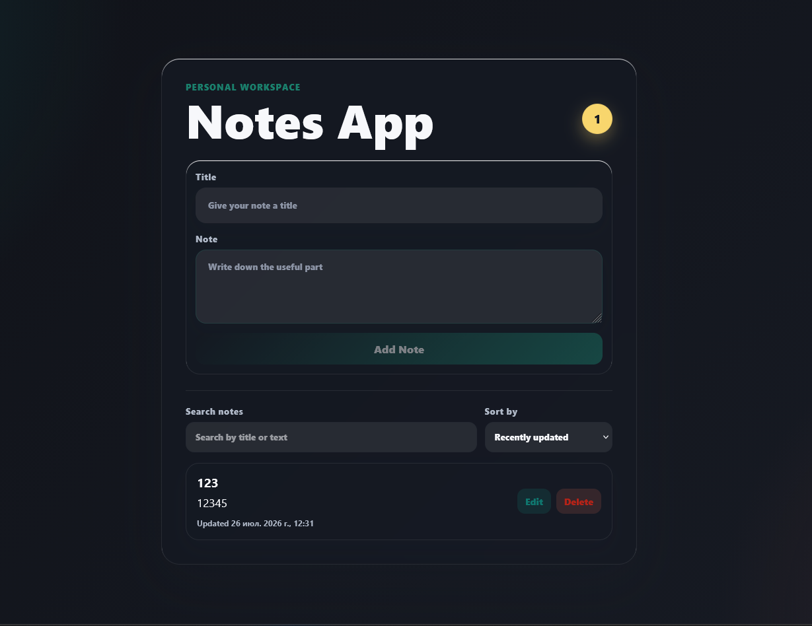
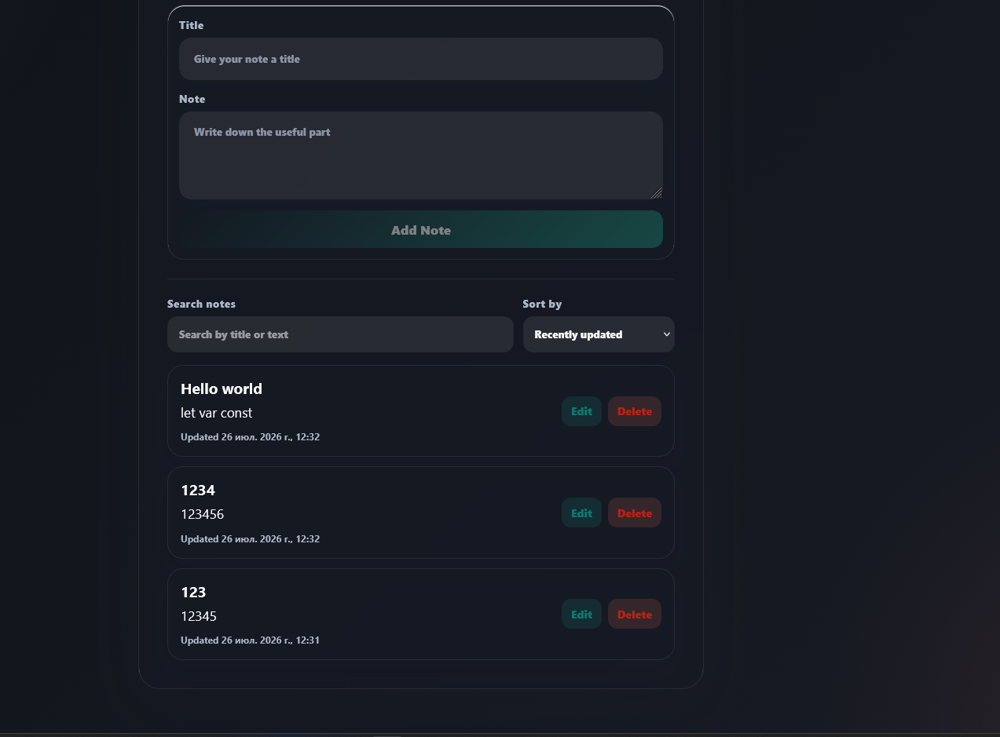

# NotesUp

A React and TypeScript application for creating, organizing, and searching personal notes. Notes are stored locally using `localStorage`, allowing data to persist across browser sessions without a backend.

## Features

- Create, edit, and delete notes
- Search notes by title and content
- Sort notes by last updated date
- Persistent storage with localStorage
- Input validation to prevent empty notes

## Tech Stack

- React 19
- TypeScript
- Vite
- ESLint

## Getting Started

```bash
npm install
npm run dev
```

Open the browser at the address shown in the terminal, usually `http://localhost:5173`.

## Screenshots

### Main Screen



### Editing Note



## Demo

[Demo is not configured. If you publish the app, add the link here.](https://notesapp-blond-two.vercel.app/)

